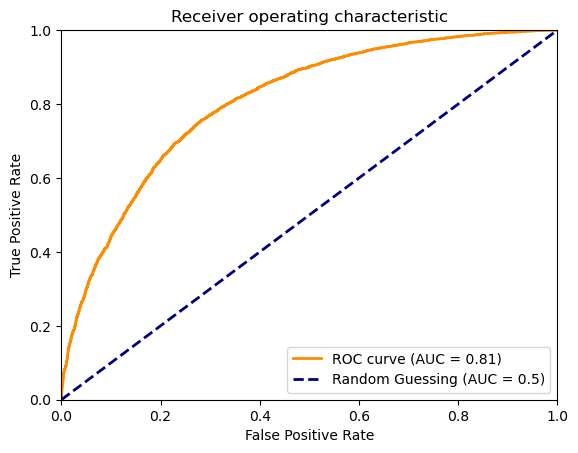

# Electron/Photon Classification

This task to classify Electrons/Photons from the given data was a success inspite of using a small model with approximately 30.5K parameters. The entire data was split as 95% for training, 2.5% for validation and the remaining 2.5% for testing. The results meet the required criteria and are summarised below:

| DataSplit       | ROC AUC score   |
| --------------- | --------------- |
| Training        | 81.2            |
| Validation      | 81.5            |
| Test            | 81.0            |

