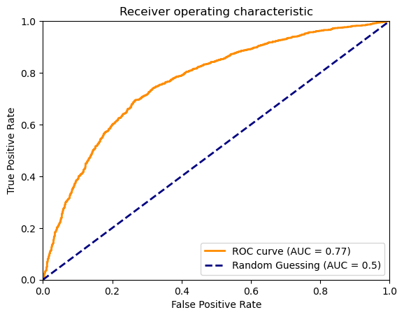

# Quark Gluon Classification

The requisite task for Quark Gluon classification has been performed with a 95-2.5-2.5 split of training,validation and testing on the entire data(all 3 parquet files). I have created an efficient streaming pipeline for data I/0 which helps us reduce our memory footprint and achieve decent results, which are summarized below:

[See notebook](./common_task_2.ipynb)

| Data Split      | ROC AUC score   |
| --------------- | --------------- |
| Training        | 0.762           |
| Validation      | 0.78            |
| Test            | 0.77            |

